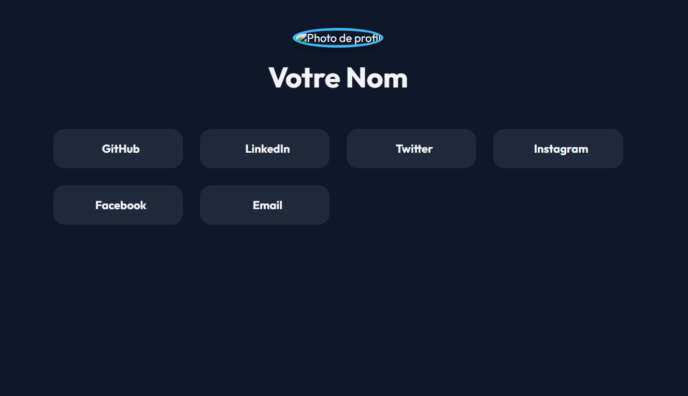

# 🌐 Page de Réseaux Sociaux | صفحة روابط التواصل

Une page web stylée et responsive pour partager vos réseaux sociaux.

صفحة ويب أنيقة ومتجاوبة لمشاركة روابط حساباتك الاجتماعية.

---

## 🚀 Déploiement rapide | النشر السريع

### Vercel  
Déployez ce site instantanément sur Vercel :

### Render  
أو انشر على Render مباشرة:

---

## ✏️ Personnalisation | التخصيص

Vous pouvez modifier facilement le contenu dans le fichier `index.html` :
- Remplacez `Votre Nom` par votre nom
- Mettez vos vrais liens dans les balises `<a href=\"...\">`
- Ajoutez ou retirez les plateformes selon vos besoins

يمكنك تعديل الملف `index.html` لتغيير الاسم والروابط حسب رغبتك.

---

## 🖼️ Aperçu | المعاينة

---

## 🆓 Licence | الرخصة

Ce projet est open-source.  
هذا المشروع مفتوح المصدر ومتاح للاستخدام بحرية.
